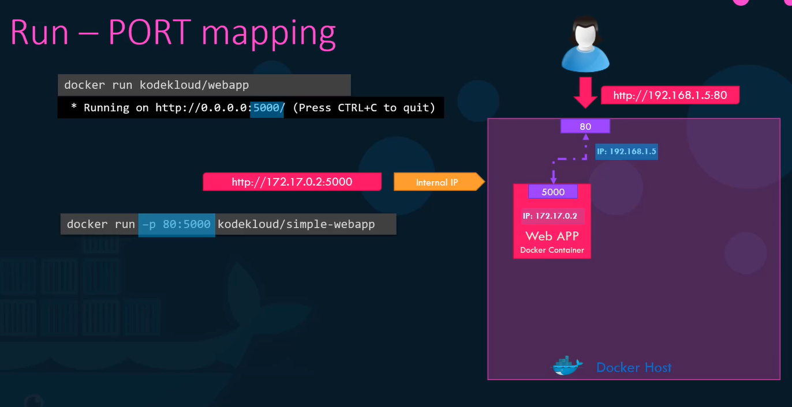
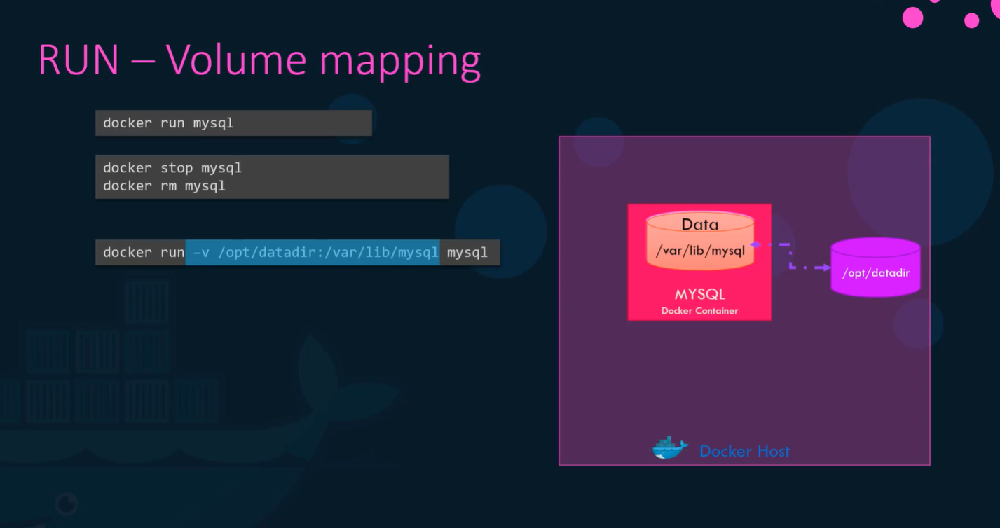
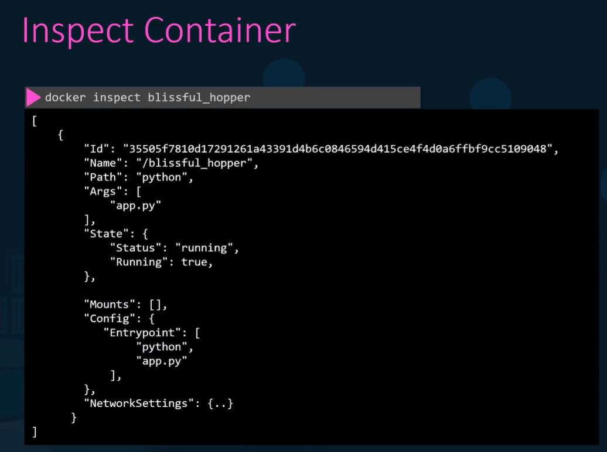
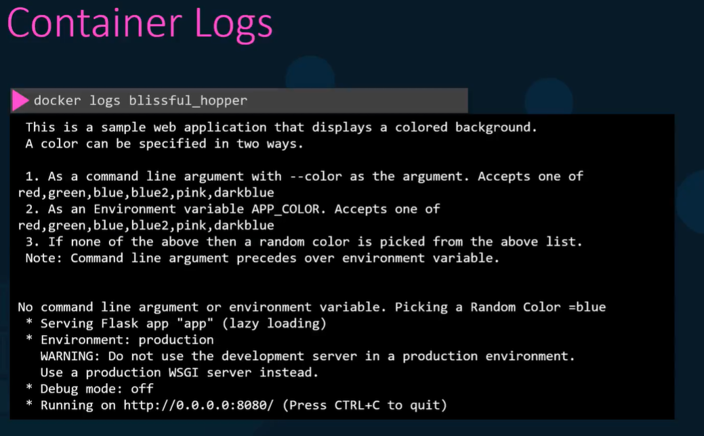
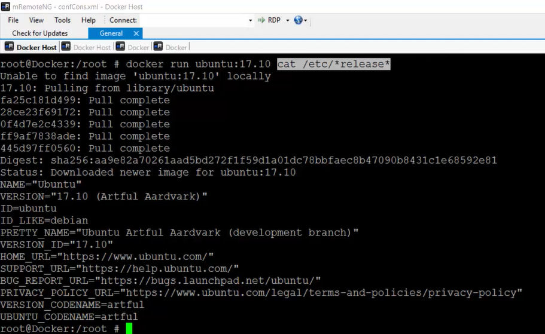
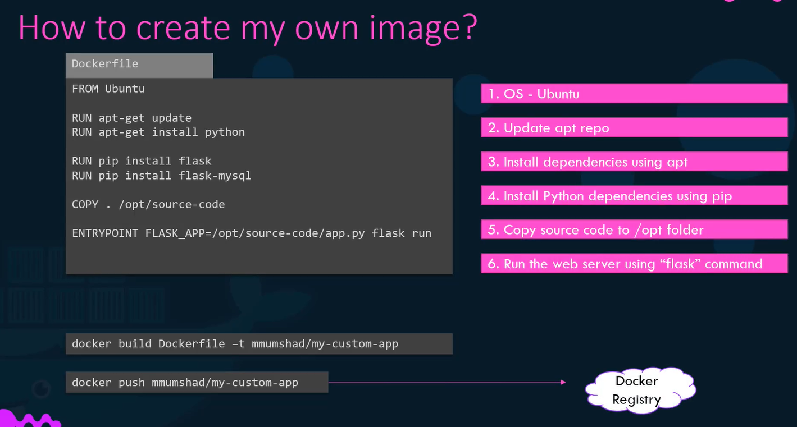
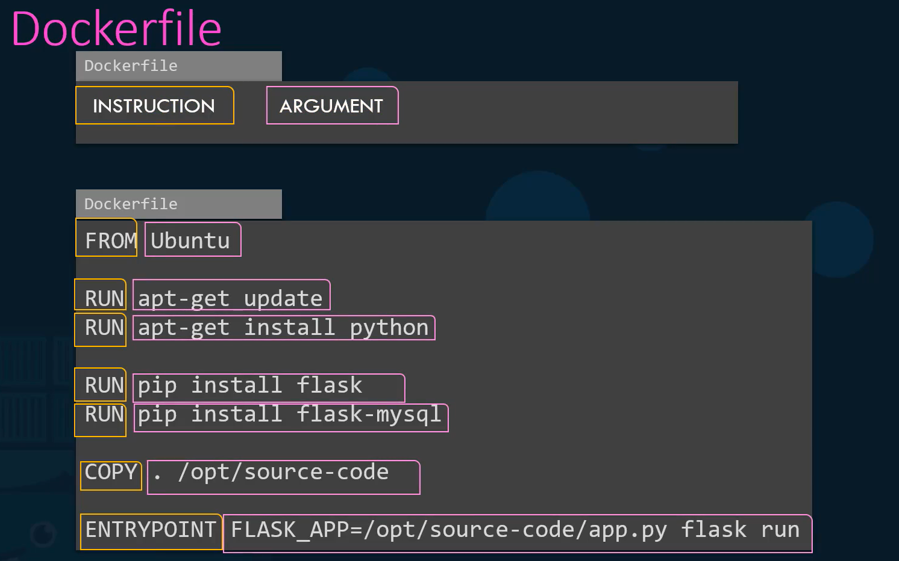
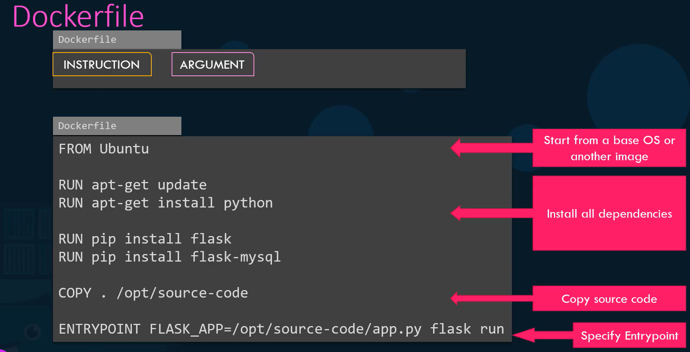

# Docker

Container vs Images

Images - is a package or a template it is used to create one or more containers
Container - is an instances of images in which they have their own environment and setup processes

DockerFile - is use to create an image for their application and this images can run in any containers.


## Docker Commands

```bash
#If the image is not available it will download to the docker repository and it will install the image
docker run ${image_name} #eg. docker run nginx

#to see the list of all running containers and some basic information about them
docker ps

#to see all the running and previously stopped or exited containers
docker ps -a

#to stop a docker container
docker stop ${container_name} #e.g. `docker stop silly_sammet` to know the name run `docker ps`

#to remove or stopped a container permanently
docker rm ${container_name} #e.g. docker rm silly_sammet

#to list all available images and their sizes on the host 
docker images

#to remove an image that you no longer want to use
docker rmi ${image_name} #e.g. docker rmi nginx (note: remember to ensure that no containers are running of that images before attempting to remove. You must stop and delete all the dependent containers to be able to delete an image)

#to pull the image or only download it
docker pull ${image_name} #e.g. docker pull nginx

#to append a command
docker run ubuntu sleep 5 #this will run the ubuntu image in a container and will sleep after 5seconds, the sleep commands exit and the container stops

#to execute a command in a running container
docker exec ${container_name} cat /etc/hosts #eg. `docker exec ubuntu cat /etc/hosts` this will execute a command in a running container and print the content of /etc/hosts

#run attach and detach
#for a running web server
docker run kodekloud/simple-webapp #you will be attached and wont be able to do anything

#to detach
docker run -d kodekloud/simple-webapp #this will run in the background and you will be back to prompt immediately

#to attach to a container
docker attach ${container_id} #e.g. docker attach a043d you can use the first 5 characters of the id if its not identical to other container id

#if you want to automatically logged in and run bash command
docker run -it centos bash

#if you want to run an image in a interactive mode
docker run -it kodekloud/application-prompt #if your application has an input functionality this will give you an ability to type your input and to activate the sudo terminal add the 't' on the option
```

Docker Host/Docker Engine - every container is running in a docker host or the underlying host where the docker is installed is called docker host/docker engine.

Run - Port Mapping

In order for a containers to access the other containers you need to know their Internal IP example on the image below:


The containers can only communicate with other containers within the docker host.

But if you attach the docker host port to the docker container port, outside of the docker host can access the containers like in the image above.

the command is

`docker run -p ${host_port}:${container_port} ${container_name}`

example:  `docker run -p 80:5000 kodekloud/simple-webapp`

then all the traffic from the docker host port 80 will be transported to the container's port 5000

### RUN - Volume Mapping

If you will persist data you would want to map the data directory outside of the docker host to a directory inside a container. The example is in the image below: 



as you can see in the image the `docker run -v /opt/datadir:/var/lib/mysql mysql`

`docker run -v ${outside_the_docker_host_directory}:${container_data_directory} mysql`

the `/opt/datadir` is the directory outside of the docker host and the `/var/lib/mysql` is the data directory of the container what will happen in here all the data from the container will be transferred outside of the docker host which is the `/opt/datadir`

### Inspect Container

If you would like to see more details of a specific container


### Container Logs

If you are running the container in a detach mode you can't see the logs of the container. In order for you to see the standard logs of the container use: 



```bash
docker logs ${container_name_or_id}
```


Running a docker container with a specific image version


# Docker Environment Variables

```bash
docker run -e APP_COLOR=blue kodekloud/simple-webapp #this will set a environment variable with an `APP_COLOR` with a value of `blue`
```

To know what is the environment variable in a container run

```bash
docker inspect ${container_name_or_id}
```

# How to create your own docker image?
```bash
docker build Dockerfile -t ${image_name} # to create your own image

docker push ${image_name} # to push your docker image into docker hub
```




## What is a Dockerfile?

Dockerfile is a text file written in a specific format that the docker will understand it is written in a standard format.

Everything on the left is an instruction and everything on the right is the argument.



